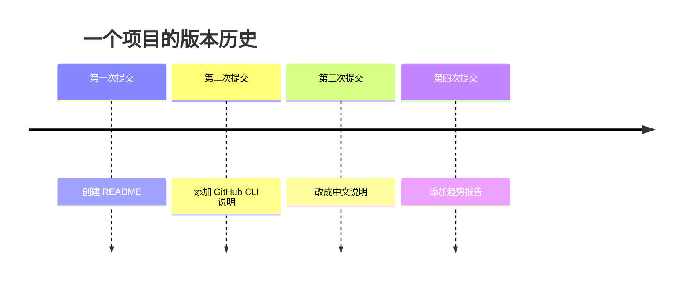

# 01 Git 是什么

Git 是一个用来管理文件版本的工具，最常见的使用场景是管理代码。

你可以把 Git 想成“项目的时间机器”：

- 今天代码能跑，先保存一个版本。
- 明天改坏了，可以对比哪里坏了。
- 后天想回到今天的状态，也有办法找回来。

## Git 和普通复制文件有什么区别

很多人刚开始会这样备份文件：

```text
项目-最终版
项目-最终版2
项目-最终版真的最终版
项目-最终版这次真不改了
```

Git 做的是更专业的版本管理：



每一次 [[提交 Commit]] 都是一张清晰的快照。

## Git 适合管理什么

- 代码
- 文档
- 配置文件
- Markdown 笔记

Git 不太适合管理特别大的二进制文件，比如超大的视频、压缩包、安装包。

## 相关概念

- [[02 仓库 Repository]]
- [[03 工作区 暂存区 提交]]
- [[05 远程仓库 Remote]]
