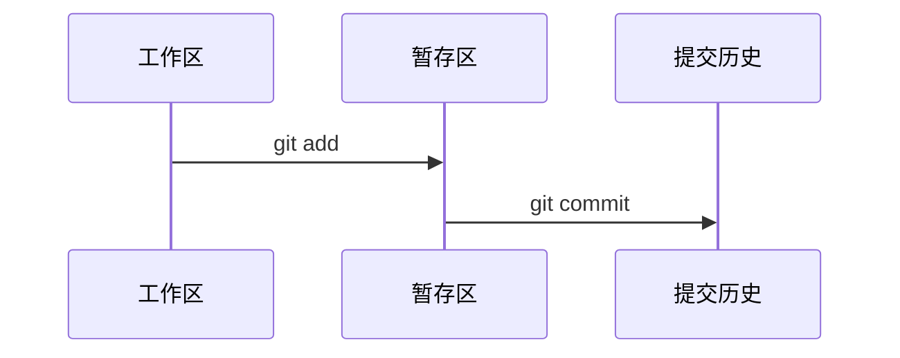

# 03 工作区 暂存区 提交

Git 最重要的一条线是：

```text
工作区 -> 暂存区 -> 提交
```

## 工作区 Working Directory

工作区就是你正在编辑的文件夹。

你打开 README，改几个字，这些改动首先都在工作区里。

## 暂存区 Staging Area

暂存区像一个“准备提交的清单”。

你用这个命令把文件放进暂存区：

```powershell
git add README.md
```

如果想把当前目录所有改动都放进去：

```powershell
git add .
```

## 提交 Commit

提交就是正式保存一次版本快照。

```powershell
git commit -m "写清楚这次改了什么"
```

## 图解流程



## 最常用组合

```powershell
git status
git add .
git commit -m "更新说明文档"
```

## 相关概念

- [[提交 Commit]]
- [[07 常用命令速查]]
