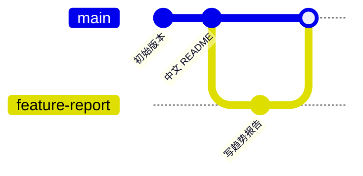

# 04 分支 Branch

分支，英文叫 Branch。

大白话说：分支就是从当前项目复制出一条“平行路线”，你可以在这条路线里放心改东西，不影响主线。

## 为什么需要分支

假设主分支 `main` 是稳定版本。

你想加一个新功能，但还不知道会不会写坏。这个时候就可以开一个新分支。



## 常用命令

```powershell
# 查看当前分支
git branch

# 创建新分支
git branch feature-demo

# 切换分支
git switch feature-demo

# 创建并切换到新分支
git switch -c feature-demo
```

## main 是什么

`main` 通常是项目的主分支。正式、稳定、要给别人看的内容，一般都放在 `main` 上。

## 相关概念

- [[03 工作区 暂存区 提交]]
- [[05 远程仓库 Remote]]
- [[07 常用命令速查]]
