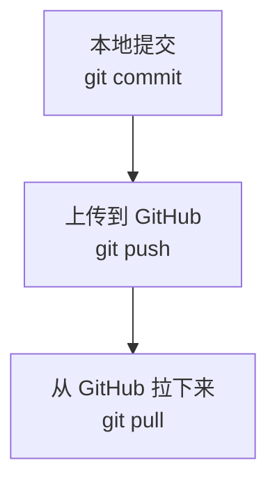

# 05 远程仓库 Remote

远程仓库，英文叫 Remote。

大白话说：远程仓库就是放在网上的仓库。最常见的位置就是 GitHub。

## 为什么要有远程仓库

- 备份代码，不怕电脑坏。
- 多台电脑之间同步项目。
- 和别人一起协作。
- 让别人可以看到你的项目。

## push 和 pull



## 常用命令

```powershell
# 查看远程仓库
git remote -v

# 上传当前分支
git push

# 从远程拉取更新
git pull
```

## origin 是什么

`origin` 通常是远程仓库的默认名字。

比如：

```text
origin  https://github.com/hencter/git-learn.git
```

这表示你的本地仓库连接到了这个 GitHub 仓库。

## 相关概念

- [[02 仓库 Repository]]
- [[06 GitHub 和 GitHub CLI]]
