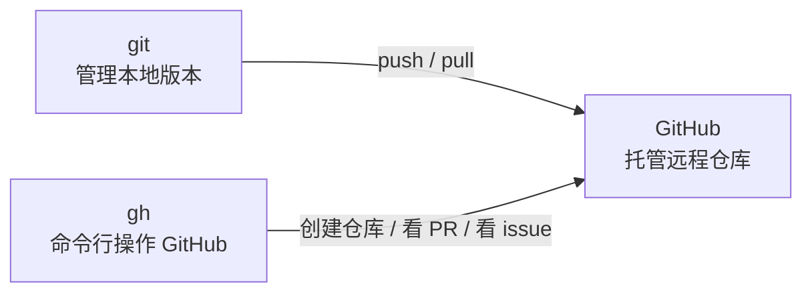

# 06 GitHub 和 GitHub CLI

Git 和 GitHub 不是同一个东西。

## Git 是什么

Git 是你电脑上的版本管理工具。

它负责：

- 记录改动
- 创建提交
- 管理分支
- 回到历史版本

## GitHub 是什么

GitHub 是一个代码托管网站。

它负责：

- 存放远程仓库
- 展示代码
- 协作开发
- 管理 issue 和 pull request

## GitHub CLI 是什么

GitHub CLI，也叫 `gh`，是 GitHub 官方命令行工具。

它可以让你在终端里操作 GitHub。



## 常用 gh 命令

```powershell
# 查看 GitHub CLI 登录状态
gh auth status

# 登录 GitHub
gh auth login

# 查看当前仓库信息
gh repo view

# 创建 GitHub 仓库并上传当前项目
gh repo create --source . --remote origin --push

# 打开当前 GitHub 仓库网页
gh browse
```

## 相关概念

- [[01 Git 是什么]]
- [[05 远程仓库 Remote]]
- [[07 常用命令速查]]
