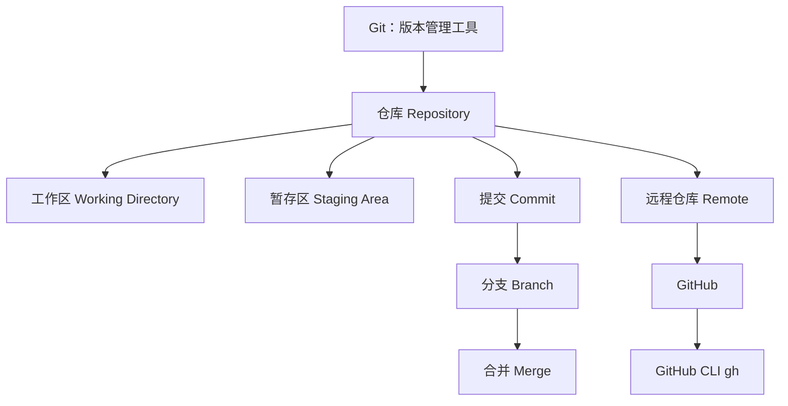

# Git 知识图谱

这是一份给 Obsidian 用的 Git 入门知识图谱。你可以从这篇开始看，也可以打开 Obsidian 的 Graph View，看这些概念之间的连接。

## Git 是什么

Git 是一个“版本管理工具”。

大白话说：它像一个可以给代码拍快照的工具。你每完成一小段工作，就可以让 Git 记录一次。以后如果写坏了、想对比、想回到以前的版本，都可以找回来。

Git 主要解决三件事：

- 记录文件什么时候改了、改了什么。
- 让你可以回到以前的版本。
- 让多人可以一起改同一个项目。

## 一张总览图



## 推荐阅读顺序

1. [[01 Git 是什么]]
2. [[02 仓库 Repository]]
3. [[03 工作区 暂存区 提交]]
4. [[04 分支 Branch]]
5. [[05 远程仓库 Remote]]
6. [[06 GitHub 和 GitHub CLI]]
7. [[07 常用命令速查]]

## 学 Git 的核心思路

不要一开始背很多命令。先理解这条线：

```text
改文件 -> git add -> git commit -> git push
```

这条线就是日常最常用的 Git 工作流。

## 相关报告

- [[GitHub 本周趋势报告]]
